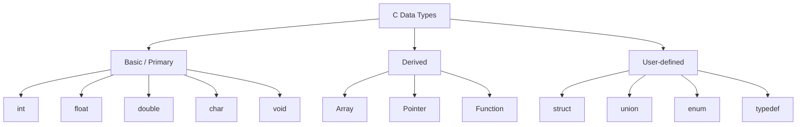

<Slide2 topic="Data Type Classification">
  <template #content>

Classification of Data Types

  

    
Basic

    
Built-in types — int, float, double, char, void.

  

  

    
Derived

    
Built FROM basic types — arrays, pointers, functions.

  

  

    
User-defined

    
You design them — struct, union, enum, typedef.

  

  
Module 2 focuses on the <strong>Basic</strong> types. Derived and user-defined types come later.

  </template>
</Slide2>
